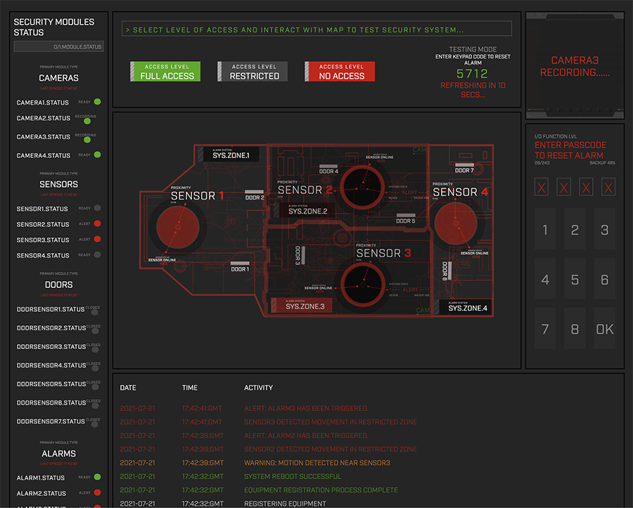

# Security-System
This is a full-stack MERN application which uses an interactive SVG to simulate real-life interactions with a security system. Hovering the mouse over different zones on the alarm system map will send requests to the server, for example, hovering over a proximity sensor zone will trigger an alarm to go off. The server will process the request, determine the correct response, before sending the updated security system state to the browser which will in turn, be reflected on screen.

-How I built this:
* Originally I built this as a purely server-side application to enable a security system to run on node.js. The application has a security system class at its center which is made up of nodes of security equipment, e.g. cameras, alarms, doors, sensors, keypads etc. Each piece of equipment is an instance of a class corresponding to its type and accordingly has relevant methods attached, e.g. a sensor would have a method to detect movement, a method to trigger the correct alarm etc.
* I built the system in such a way that the front-end React application should be able to be replaced with real hardware, for example a motion sensor running on a Raspberry Pi which can send a HTTP request. The server will then act as a live control center for processing all inputs and return the correct response, e.g. sound an alarm or store the corresponding camera footage.
* In order to demonstrate and test the security system, I built a front-end React application. This involved creating an SVG which was drawn in Adobe Illustrator that is essentially a hypothetical floorplan which is split into zones, each with a camera, a motion sensor and several doors. Each zone has a restriction level (which can be changed to test the system) which determines if the zone will respond to activity, to imitate a real life system being armed or unarmed.
* When the security system responds to the browser, the entire state of the system is reported which updates the state in the front-end application.
* When an alarm has been triggered in a zone , along with the appropriate responses, it generates a disarm code which can be typed into the server to reset the alarm. This code is regenerated every 15 seconds on the server and sent back to the browser.
* The activity log is also an important part of the application in that every interaction in the security system is recorded in a log and stored in a mongo database. This updating activity log is displayed at the bottom of the React front-end. 
* In terms of the virtual equipment (cameras,sensors,doors etc.), the only thing that is stored on the database is the model number of each piece and its type. When the server boots up, it launches the security system; the equipment is fetched from the database, then each is instantiated with the type specific class, a confirmation that the equipment is running is added to the activity log and the system will then be 'live' waiting to respond to any request that are sent to the server from the browser.

-What I learnt:
* The most interesting part of creating this project was to build a 'live' system that represents a real life security network. The nature of this objective leant itself well to taking an object-oriented approach where the security system and all its inherent parts are represented as objects.  
* In order to have a front-end and back-end working in sync involved working with cors to enable the two sides to communicate with each other.
* Prior to building a front-end to interact with the system, I had been experimenting with hardware. I learnt how to use a breadboard and GPIO ports to wire up a proximity sensor to initiate an event when the sensor is triggered. 
* I learnt how to combine Adobe Illustrator and the browser to create an interactive SVG. I also used the CSS property stroke-dashoffset to create an interesting animation to give the appearance that the security system is resetting itself once the correct password is typed in. 

-What I would do differently if I were to do it again:
* Instead of using a traditional HTTP request/response it may have been advantageous to use WebSockets. The main benefit of this would be avoiding the HTTP request/response overhead for each event triggered in the browser resulting in a faster reaction time.   
* I still intend to implement the hardware components using a Raspberry Pi to run the applications as a real security system at home.  
* Organise the SVG better.

