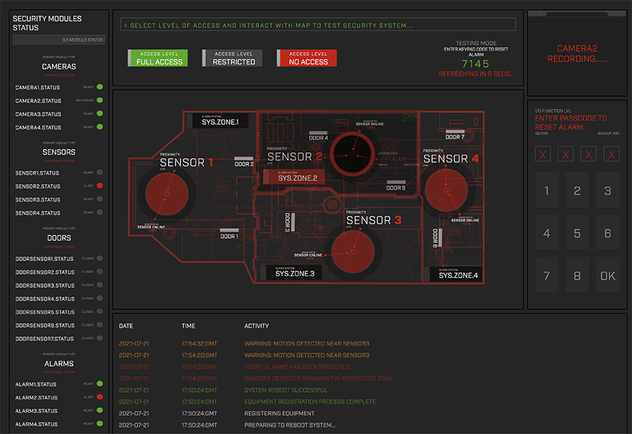

# Security-System
This is a full-stack MERN application which uses an interactive SVG to simulate real-life interactions with a security system. Hovering the mouse over different zones on the alarm system map will send requests to the server. The server will process the request, determine the correct response and send the response to the browser where the updated security system state will be reflected on screen.

-How I built this:
* Originally I built this as a purely server-side application to enable a security system to run on node.js. The application has a security system class at its center which is made up of nodes of security equipment, e.g. cameras, alarms, doors, sensors, keypads etc. Each piece of equipment is an instance of a class corresponding to its type and accordingly has relevant methods attached, for example a sensor would have a method to detect movement, a method to trigger the correct alarm etc.
* I built the system in such a way that the front-end React application should be able to be replaced with real hardware, for example a motion sensor which can send a HTTP request (running on a Raspeberry Pi for example). The server will then act as a live control center for processing all inputs and return the correct response, e.g. sound an alarm or store the corresponding camera footage.
* In order to demonstrate and test the security system, I built a front-end React application. This involved creating an SVG which was drawn in illustrator that is essentially a hypothetical floorplan which is split into zones, each with a camera, a motion sensor and several doors. Each zone has a restriction level (which can be changed to test the system) which determines if the zone will respond to activity, to imitate a real life system being armed or unarmed.
* When the security system responds to the browser, the entire state of the system is reported which updates the state in the front-end application.
* When an alarm has been triggered in a zone , along witht the approproate responses, it generates a disarm code which can be typed into the server to reset the alarm. This code is regenerated every 15 seconds on the server and sent back to the browser.
* The activity log is also an important part of the application in that every interaction in the security system is recorded in a log and stored in a mongo database. 
* In terms of the equiptment, the only thing that is stored on the database is the model number and type etc. This more closely resembles a real life security system where the equipment itself would manage what state it is in as opposed ot the database. This means that when the server is rebooted the system will set up like a real life system.

-What I learnt:
* Working with cors
* Building a live system
* have a front end and back-end working in sync
* working with raspberry pi
* animate a svg/ CSS tricks

-What I would do differently if I were to do it again:
* Sockets.io
* I am still planning on implementing the hardware components in a raspebrry pi
* sort out the svg

